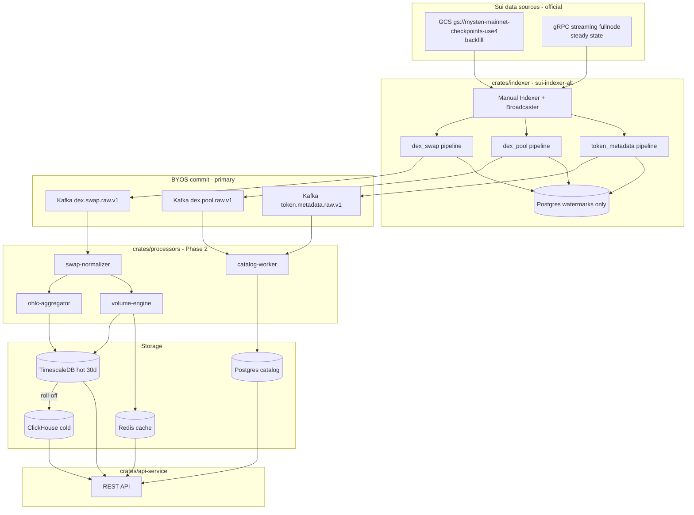

# 02 — System Architecture (Frozen)

**Last updated:** 2026-06-03  
**Status:** Frozen — greenfield implementation  
**Note:** `examples/` is reference only. Production code lives in `crates/` (to be created).

---

## 1. Architecture principles

1. **Greenfield** — build production services from scratch; do not extend `examples/`.
2. **Official `sui-indexer-alt` patterns** — manual `Indexer`, BYOS, GCS + gRPC streaming, Prometheus metrics.
3. **Event-first ingestion** for DEX — not full-network state diff.
4. **Kafka as primary fact store (BYOS)** — `commit()` writes facts; watermarks in minimal Postgres.
5. **Multiple pipelines** — swap, pool, metadata each with own handler + watermark.
6. **Derived metrics outside indexer** — OHLC/volume in Kafka consumers → TimescaleDB/Redis.
7. **Replay over patch** — every message carries `checkpoint_seq` + `tx_digest`.

---

## 2. High-level diagram (production target)



**No `examples/` components in this path.**

---

## 3. Layer 0 — Chain data sources (official)

Per [Integrate Data Sources](https://docs.sui.io/develop/accessing-data/custom-indexer/indexer-data-integration):

| Source | Role | Config |
|--------|------|--------|
| **GCS checkpoint bucket** | Backfill, full retention | `gs://mysten-mainnet-checkpoints-use4` + Requester Pays |
| **gRPC streaming** | Steady state, low latency | `https://fullnode.mainnet.sui.io:443` |
| **HTTPS remote store** | Emergency fallback only | 30-day retention — not for prod backfill |
| **Archival gRPC** | Optional | Pre-pruning history if needed |

Framework: `sui-indexer-alt-framework` — `Broadcaster`, adaptive `ingest_concurrency`, backpressure.

---

## 4. Layer 1 — Indexer (`crates/indexer`)

### 4.1 Framework setup (official)

| Choice | Decision | Rationale |
|--------|----------|-----------|
| Entry point | Manual `Indexer::new()` | BYOS requires manual indexer per [BYOS docs](https://docs.sui.io/develop/accessing-data/custom-indexer/bring-your-own-store) |
| Store | `CompositeStore` | Kafka for facts + Postgres for watermarks only |
| Pipeline type | **Sequential** first | Official: start sequential, measure, upgrade to concurrent if needed |
| Pipelines | 3+ separate handlers | Official: one pipeline per data kind |

### 4.2 Pipelines

| Pipeline | `process()` filters | BYOS `commit()` target |
|----------|---------------------|------------------------|
| `dex_swap` | Swap events (all DEXes) | `dex.swap.raw.v1` |
| `dex_pool` | Pool create events | `dex.pool.raw.v1` |
| `token_metadata` | CoinMetadata / publish (Phase 1b) | `token.metadata.raw.v1` |
| `coin_balance` (Phase 4) | Scoped balance effects | `coin.balance_change.v1` |

### 4.3 `process()` responsibilities (thin)

- Filter by protocol package / event type
- Decode BCS via `crates/event-bindings` (static `move_contract!`)
- Emit typed rows — **no OHLC, no aggregation**

### 4.4 `commit()` responsibilities (BYOS)

- Idempotent Kafka produce (key = `tx_digest + event_seq`)
- Batch for throughput
- Watermark advance in Postgres (same transaction boundary where possible)

Reference implementation: [clickhouse-sui-indexer](https://github.com/MystenLabs/sui/tree/main/examples/rust/clickhouse-sui-indexer) for BYOS `Store`/`Connection` shape (adapt for Kafka).

### 4.5 Runtime tuning

Per [Optimize Runtime and Performance](https://docs.sui.io/develop/accessing-data/custom-indexer/indexer-runtime-perf):

| Knob | Backfill | Steady state |
|------|----------|--------------|
| `ingest_concurrency` | Adaptive or Fixed ~200 | Adaptive default |
| `collect_interval_ms` | 500–1000 | 200–500 |
| `fanout` (processor) | Adaptive, raise max if IO-bound Kafka | Default |
| Prometheus | Scrape `:9184/metrics` | Alert watermark lag |

### 4.6 Indexing strategy (frozen)

| Data need | Strategy |
|-----------|----------|
| Swaps, volume, OHLC, tx count | Event indexing |
| Pool discovery | Event indexing |
| Token metadata | Targeted events / objects |
| Holders (Phase 4) | Coin balance pipeline |
| Bubble map (Phase 5) | Transfer edges from balance pipeline |
| **Not used** | Full-network object state diff |

---

## 5. Layer 2 — Stream processing (`crates/processors`)

Independent Kafka consumer groups — **not** part of `sui-indexer-alt`:

| Worker | Input | Output |
|--------|-------|--------|
| `swap-normalizer` | `dex.swap.raw.v1` | `dex.swap.normalized.v1` |
| `catalog-worker` | `dex.pool.raw.v1`, `token.metadata.raw.v1` | Postgres `tokens`, `pools` |
| `ohlc-aggregator` | `dex.swap.normalized.v1` | TimescaleDB `ohlc_*` |
| `volume-engine` | `dex.swap.normalized.v1` | TimescaleDB + Redis |
| `rolloff-job` | TimescaleDB | ClickHouse |

---

## 6. Layer 3 — Storage

| Store | Role | Retention |
|-------|------|-----------|
| **Postgres** | Watermarks + catalog (`tokens`, `pools`, `protocols`) | Long |
| **Kafka** | Raw facts (primary ingestion output) | 7–14 days |
| **TimescaleDB** | Hot OHLC, swaps, liquidity | 30 days |
| **ClickHouse** | Cold analytics, transfer edges | Long |
| **Redis** | API hot cache (price, vol 24h) | Minutes TTL |

**No `package_events` staging table in production** — optional QA tool in `tools/reconciliation` compares Kafka vs fullnode.

---

## 7. Layer 4 — API (`crates/api-service`)

REST only — no `suix_queryEvents` compatibility layer in production.

| Endpoint group | Data source |
|----------------|---------------|
| Token detail | Postgres + Redis |
| Pools per token | Postgres |
| OHLC chart | TimescaleDB / ClickHouse by range |
| Swap history | TimescaleDB / ClickHouse |

---

## 8. Production repo layout (target)

```
sui-indexer/
├── crates/
│   ├── indexer/              # sui-indexer-alt + BYOS Kafka + pipelines
│   ├── event-bindings/       # move_contract! decode (from docs/contracts)
│   ├── indexer-store/        # CompositeStore: Kafka + Postgres watermarks
│   ├── processors/           # Kafka consumers (Phase 2)
│   └── api-service/          # REST API (Phase 2)
├── infra/
│   ├── docker-compose.yml    # kafka, postgres, timescale, clickhouse, redis
│   └── prometheus/
├── tools/
│   └── reconciliation/       # Optional QA — compare Kafka/fullnode
├── examples/                 # ⚠️ REFERENCE ONLY — do not deploy
├── docs/
│   ├── contracts/            # DEX Move interfaces (used by event-bindings)
│   └── ...
└── Cargo.toml                # workspace root
```

---

## 9. Observability

| Signal | Source |
|--------|--------|
| Indexer lag | Prometheus watermark metrics (`:9184/metrics`) |
| Kafka lag | Consumer group metrics |
| Decode errors | Custom counter on `process()` |
| API latency | `api-service` metrics |

---

## 10. Phase 4–5 (unchanged intent)

- **Holders:** `coin_balance` indexer pipeline → Kafka → Postgres balances
- **Bubble map:** transfer edges → ClickHouse → subgraph API

See [01-product-scope.md](./01-product-scope.md) Phase 4–5.
