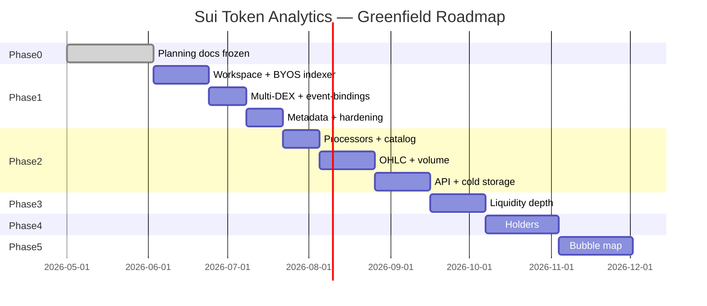

# 03 — Roadmap & Timeline (Frozen)

**Last updated:** 2026-06-03  
**Implementation:** Greenfield from `crates/` — `examples/` not in prod path  
**Planning horizon:** ~18 weeks (1 dev) / ~11 weeks (2 devs)

---

## 1. Milestone overview

---

## 2. Phase 0 — Planning ✅

| Deliverable | Status |
|-------------|--------|
| `docs/01`–`06` planning set | ✅ |
| `docs/contracts/` DEX interfaces | ✅ |
| `examples/` spikes | ✅ Reference only |

**Not a production milestone.**

---

## 3. Phase 1 — Data Ingestion (7 weeks)

**Start:** 2026-06-03 · **Target:** 2026-07-22

### Week 1–2: Greenfield indexer skeleton

**Detailed plan:** [plans/week-01-02-greenfield-indexer.md](./plans/week-01-02-greenfield-indexer.md) · **VI:** [vi/plans/week-01-02-greenfield-indexer.md](./vi/plans/week-01-02-greenfield-indexer.md)

| Task | Exit criteria |
|------|---------------|
| Cargo workspace `crates/indexer`, `crates/indexer-store`, `crates/event-bindings` | `cargo build` passes |
| Manual `Indexer` + testnet gRPC streaming (+ HTTPS fallback) | Catches checkpoints on testnet |
| `CompositeStore`: Kafka BYOS + Postgres watermarks | Facts on Kafka; watermark advances |
| Stub sequential pipeline (`stub_events`) | End-to-end proof before DEX pipelines |
| `infra/docker-compose.yml` (Kafka, Postgres) | Local stack runs |
| Prometheus scrape `:9184/metrics` | Dashboard stub |

### Week 3–4: Pipelines + Cetus/Turbos

| Task | Exit criteria |
|------|---------------|
| `dex_swap` + `dex_pool` sequential pipelines | Separate watermarks |
| Cetus + Turbos `event-bindings` | Unit tests with BCS from `events.md` |
| Bluefin + MMT bindings | Swap events on Kafka |

### Week 5–6: Remaining DEXes + metadata

| Task | Exit criteria |
|------|---------------|
| FlowX + Magma | Kafka coverage complete |
| `token_metadata` pipeline | Sample tokens decoded |
| `tools/reconciliation` (optional) | Kafka vs fullnode sample window |

### Week 7: Hardening

| Task | Exit criteria |
|------|---------------|
| HTTPS backfill + gRPC steady state | Catches up to tip (≤30d via HTTPS; GCS deferred) |
| Runtime tuning per official perf docs | Lag < 30s steady state |
| Phase 1 gate checklist | All pass |

**Detailed plan:** [plans/week-07-hardening.md](./plans/week-07-hardening.md)

**Phase 1 gate:**
- [x] Production code only in `crates/` — zero dependency on `examples/`
- [ ] GCS backfill — **deferred** (HTTPS-only accepted for Phase 1; >30d when budget allows)
- [x] Kafka = primary BYOS commit
- [x] ≥ 4 DEX protocols (6: Cetus, Turbos, Bluefin, MMT, FlowX, Magma)
- [x] Prometheus watermark alerts (`infra/prometheus/alerts.yml`)

---

## 4. Phase 2 — Processing & API (8 weeks)

**Target MVP:** 2026-09-16

| Sprint | Focus |
|--------|-------|
| Week 8–9 | [`crates/processors`](docs/plans/week-08-09-processors.md): normalizer + catalog → Postgres |
| Week 10–12 | [`OHLC + volume → TimescaleDB + Redis`](docs/plans/week-10-12-ohlc-volume.md) |
| Week 13–15 | [`api-service` REST + ClickHouse roll-off](docs/plans/week-13-15-api-clickhouse.md) |

**MVP gate:** Token detail with volume, price, pools, OHLC chart, swap history.

---

## 5. Phase 3–5

Unchanged intent — see previous timeline for holders (4w) and bubble map (4w).

---

## 6. What we borrow vs rebuild

| From `examples/` | Action |
|------------------|--------|
| `move-binding` vendor / codegen approach | **Rewrite** in `crates/event-bindings` |
| Prefix filter logic | **Reimplement** — same idea, clean API |
| Handler structure | **Reimplement** — split into multiple pipelines |
| `rpc-service` | **Discard** for prod — use `api-service` |
| `reconciliation` | **Optional rewrite** in `tools/` for QA |
| `package_events` schema | **Discard** — Kafka is source of truth |

---

## 7. Immediate next actions (Week 1)

| # | Action |
|---|--------|
| 1 | Create root `Cargo.toml` workspace |
| 2 | Scaffold `crates/indexer` with manual `Indexer` |
| 3 | Implement `crates/indexer-store` (Kafka BYOS + PG watermarks) |
| 4 | `infra/docker-compose.yml` |
| 5 | Port Cetus/Turbos bindings into `crates/event-bindings` (fresh crate, not copy `examples/`) |
