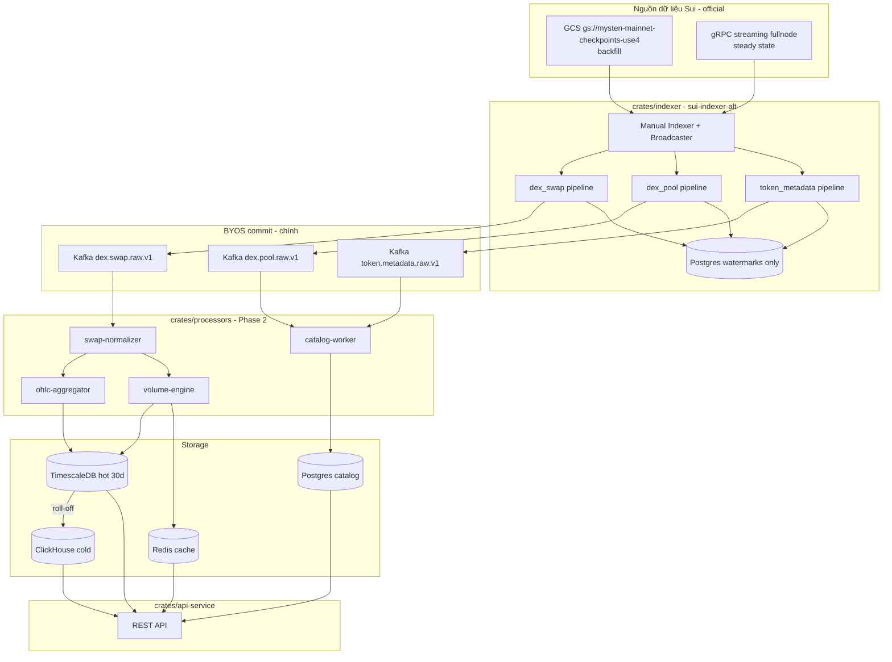

# 02 — Kiến trúc hệ thống (Đã chốt)

**Cập nhật:** 2026-06-03  
**Trạng thái:** Đã chốt — triển khai greenfield  
**Lưu ý:** `examples/` chỉ tham khảo. Code production nằm trong `crates/` (sẽ tạo).

> **English:** [../02-system-architecture.md](../02-system-architecture.md)

---

## 1. Nguyên tắc kiến trúc

1. **Greenfield** — xây production từ đầu; không mở rộng `examples/`.
2. **Theo official `sui-indexer-alt`** — manual `Indexer`, BYOS, GCS + gRPC streaming, Prometheus.
3. **Event-first** cho DEX — không full state diff toàn mạng.
4. **Kafka là kho fact chính (BYOS)** — `commit()` ghi fact; watermark trong Postgres tối thiểu.
5. **Nhiều pipeline** — swap, pool, metadata mỗi cái có handler + watermark riêng.
6. **Metric dẫn xuất ngoài indexer** — OHLC/volume qua Kafka consumer → TimescaleDB/Redis.
7. **Replay thay vì patch** — mọi message mang `checkpoint_seq` + `tx_digest`.

---

## 2. Sơ đồ tổng quan (production target)



**Không có component từ `examples/` trong luồng này.**

---

## 3. Lớp 0 — Nguồn dữ liệu on-chain (official)

Theo [Integrate Data Sources](https://docs.sui.io/develop/accessing-data/custom-indexer/indexer-data-integration):

| Nguồn | Vai trò | Cấu hình |
|-------|---------|----------|
| **GCS checkpoint bucket** | Backfill, retention đầy đủ | `gs://mysten-mainnet-checkpoints-use4` + Requester Pays |
| **gRPC streaming** | Steady state, độ trễ thấp | `https://fullnode.mainnet.sui.io:443` |
| **HTTPS remote store** | Fallback khẩn cấp | Chỉ 30 ngày — không dùng backfill prod |
| **Archival gRPC** | Tùy chọn | Lịch sử trước khi prune |

Framework: `sui-indexer-alt-framework` — `Broadcaster`, `ingest_concurrency` adaptive, backpressure.

---

## 4. Lớp 1 — Indexer (`crates/indexer`)

### 4.1 Thiết lập framework (official)

| Lựa chọn | Quyết định | Lý do |
|----------|------------|-------|
| Entry point | Manual `Indexer::new()` | BYOS yêu cầu manual indexer |
| Store | `CompositeStore` | Kafka fact + Postgres watermark |
| Loại pipeline | **Sequential** trước | Official: đo hiệu năng rồi mới lên concurrent |
| Số pipeline | ≥ 3 handler tách biệt | Mỗi loại dữ liệu một pipeline |

### 4.2 Các pipeline

| Pipeline | `process()` lọc | BYOS `commit()` ghi vào |
|----------|-----------------|-------------------------|
| `dex_swap` | Swap events (mọi DEX) | `dex.swap.raw.v1` |
| `dex_pool` | Pool create events | `dex.pool.raw.v1` |
| `token_metadata` | CoinMetadata / publish (Phase 1b) | `token.metadata.raw.v1` |
| `coin_balance` (Phase 4) | Balance effects có phạm vi | `coin.balance_change.v1` |

### 4.3 Trách nhiệm `process()` (mỏng)

- Lọc theo package / event type
- Decode BCS qua `crates/event-bindings` (`move_contract!`)
- Xuất row có kiểu — **không** OHLC, không aggregation

### 4.4 Trách nhiệm `commit()` (BYOS)

- Kafka produce idempotent (key = `tx_digest + event_seq`)
- Batch để tăng throughput
- Cập nhật watermark Postgres (cùng transaction boundary nếu có thể)

Tham khảo: [clickhouse-sui-indexer](https://github.com/MystenLabs/sui/tree/main/examples/rust/clickhouse-sui-indexer) — hình dạng `Store`/`Connection` BYOS (adapt cho Kafka).

### 4.5 Tuning runtime

Theo [Optimize Runtime and Performance](https://docs.sui.io/develop/accessing-data/custom-indexer/indexer-runtime-perf):

| Tham số | Backfill | Steady state |
|---------|----------|--------------|
| `ingest_concurrency` | Adaptive hoặc Fixed ~200 | Adaptive mặc định |
| `collect_interval_ms` | 500–1000 | 200–500 |
| `fanout` (processor) | Tăng max nếu Kafka IO-bound | Mặc định |
| Prometheus | Scrape `:9184/metrics` | Cảnh báo watermark lag |

### 4.6 Chiến lược indexing (đã chốt)

| Nhu cầu dữ liệu | Chiến lược |
|-----------------|------------|
| Swap, volume, OHLC, tx count | Event indexing |
| Khám phá pool | Event indexing |
| Metadata token | Event / object có mục tiêu |
| Holders (Phase 4) | Pipeline coin balance |
| Bubble map (Phase 5) | Transfer edges từ balance pipeline |
| **Không dùng** | Full state diff toàn mạng |

---

## 5. Lớp 2 — Stream processing (`crates/processors`)

Kafka consumer group độc lập — **không** thuộc `sui-indexer-alt`:

| Worker | Input | Output |
|--------|-------|--------|
| `swap-normalizer` | `dex.swap.raw.v1` | `dex.swap.normalized.v1` |
| `catalog-worker` | `dex.pool.raw.v1`, `token.metadata.raw.v1` | Postgres `tokens`, `pools` |
| `ohlc-aggregator` | `dex.swap.normalized.v1` | TimescaleDB `ohlc_*` |
| `volume-engine` | `dex.swap.normalized.v1` | TimescaleDB + Redis |
| `rolloff-job` | TimescaleDB | ClickHouse |

---

## 6. Lớp 3 — Storage

| Store | Vai trò | Retention |
|-------|---------|-----------|
| **Postgres** | Watermark + catalog | Dài hạn |
| **Kafka** | Raw facts (output ingestion chính) | 7–14 ngày |
| **TimescaleDB** | OHLC, swap, liquidity hot | 30 ngày |
| **ClickHouse** | Analytics cold, transfer edges | Dài hạn |
| **Redis** | Cache API (giá, vol 24h) | TTL vài phút |

**Không có bảng `package_events` staging trong production** — QA tùy chọn qua `tools/reconciliation`.

---

## 7. Lớp 4 — API (`crates/api-service`)

Chỉ REST — không lớp tương thích `suix_queryEvents` trong production.

| Nhóm endpoint | Nguồn dữ liệu |
|---------------|---------------|
| Token detail | Postgres + Redis |
| Pool theo token | Postgres |
| Biểu đồ OHLC | TimescaleDB / ClickHouse theo khoảng thời gian |
| Lịch sử swap | TimescaleDB / ClickHouse |

---

## 8. Cấu trúc repo production (target)

```
sui-indexer/
├── crates/
│   ├── indexer/              # sui-indexer-alt + BYOS Kafka + pipelines
│   ├── event-bindings/       # move_contract! decode
│   ├── indexer-store/        # CompositeStore: Kafka + Postgres watermarks
│   ├── processors/           # Kafka consumers (Phase 2)
│   └── api-service/          # REST API (Phase 2)
├── infra/
│   ├── docker-compose.yml
│   └── prometheus/
├── tools/
│   └── reconciliation/       # QA tùy chọn
├── examples/                 # ⚠️ CHỈ THAM KHẢO
├── docs/
│   ├── vi/                   # Bản tiếng Việt
│   └── contracts/
└── Cargo.toml
```

---

## 9. Quan sát hệ thống (Observability)

| Tín hiệu | Nguồn |
|----------|-------|
| Indexer lag | Prometheus watermark (`:9184/metrics`) |
| Kafka lag | Consumer group metrics |
| Lỗi decode | Custom counter trong `process()` |
| Độ trễ API | Metrics `api-service` |

---

## 10. Phase 4–5 (giữ nguyên ý định)

- **Holders:** pipeline `coin_balance` → Kafka → Postgres balances
- **Bubble map:** transfer edges → ClickHouse → subgraph API

Xem [01-product-scope.md](./01-product-scope.md) Phase 4–5.
