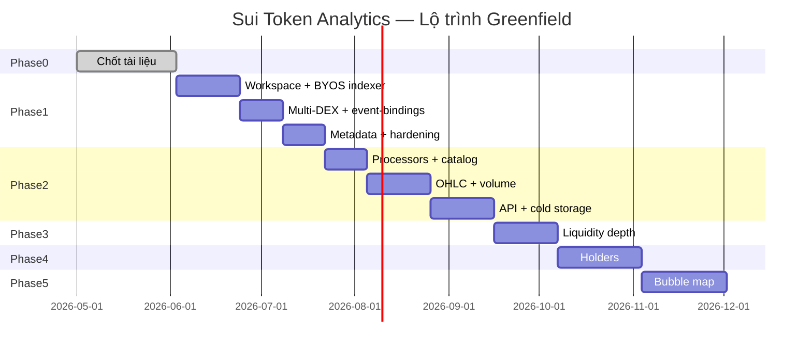

# 03 — Lộ trình & Timeline (Đã chốt)

**Cập nhật:** 2026-06-03  
**Triển khai:** Greenfield từ `crates/` — `examples/` không nằm trong prod path  
**Horizon:** ~18 tuần (1 dev) / ~11 tuần (2 dev)

> **English:** [../03-roadmap-timeline.md](../03-roadmap-timeline.md)

---

## 1. Tổng quan milestone

---

## 2. Phase 0 — Lập kế hoạch ✅

| Hạng mục | Trạng thái |
|----------|------------|
| Bộ tài liệu `docs/01`–`07` | ✅ |
| `docs/contracts/` DEX interfaces | ✅ |
| Spike `examples/` | ✅ Chỉ tham khảo |

**Không phải milestone production.**

---

## 3. Phase 1 — Thu thập dữ liệu (7 tuần)

**Bắt đầu:** 2026-06-03 · **Mục tiêu:** 2026-07-22

### Tuần 1–2: Khung indexer greenfield

**Kế hoạch chi tiết:** [plans/week-01-02-greenfield-indexer.md](../vi/plans/week-01-02-greenfield-indexer.md)

| Task | Tiêu chí hoàn thành |
|------|---------------------|
| Cargo workspace `crates/indexer`, `indexer-store`, `event-bindings` | `cargo build` pass |
| Manual `Indexer` + testnet gRPC streaming (+ HTTPS fallback) | Bắt checkpoint trên testnet |
| `CompositeStore`: Kafka BYOS + Postgres watermarks | Fact lên Kafka; watermark tăng |
| Pipeline stub (`stub_events`) | Chứng minh end-to-end trước DEX |
| `infra/docker-compose.yml` (Kafka, Postgres) | Stack local chạy được |
| Prometheus scrape `:9184/metrics` | Dashboard stub |

### Tuần 3–4: Pipeline + Cetus/Turbos

| Task | Tiêu chí hoàn thành |
|------|---------------------|
| Pipeline sequential `dex_swap` + `dex_pool` | Watermark tách biệt |
| `event-bindings` Cetus + Turbos | Unit test BCS từ `events.md` |
| Bindings Bluefin + MMT | Swap events trên Kafka |

### Tuần 5–6: DEX còn lại + metadata

| Task | Tiêu chí hoàn thành |
|------|---------------------|
| FlowX + Magma | Kafka coverage đủ |
| Pipeline `token_metadata` | Decode mẫu token |
| `tools/reconciliation` (tùy chọn) | So sánh Kafka vs fullnode |

### Tuần 7: Hardening

| Task | Tiêu chí hoàn thành |
|------|---------------------|
| Mainnet GCS backfill | Bắt kịp chain tip |
| Runtime tuning theo official perf docs | Lag < 30s steady state |
| Phase 1 gate checklist | Tất cả pass |

**Cổng Phase 1:**
- [ ] Code production chỉ trong `crates/` — không deploy từ `examples/`
- [ ] GCS backfill (không chỉ HTTPS)
- [ ] Kafka = BYOS commit chính
- [ ] ≥ 4 giao thức DEX
- [ ] Cảnh báo Prometheus watermark

---

## 4. Phase 2 — Xử lý & API (8 tuần)

**MVP target:** 2026-09-16

| Sprint | Trọng tâm |
|--------|-----------|
| Tuần 8–9 | `processors`: normalizer + catalog → Postgres |
| Tuần 10–12 | OHLC + volume → TimescaleDB + Redis |
| Tuần 13–15 | `api-service` REST + ClickHouse roll-off |

**Cổng MVP:** Token detail có volume, giá, pools, biểu đồ OHLC, lịch sử swap.

---

## 5. Phase 3–5

Giữ nguyên ý định — holders (4 tuần), bubble map (4 tuần).

---

## 6. Mượn gì từ `examples/` vs xây lại

| Từ `examples/` | Hành động |
|----------------|-----------|
| `move-binding` / codegen | **Viết lại** trong `crates/event-bindings` |
| Logic lọc prefix | **Implement lại** — cùng ý tưởng, API sạch |
| Cấu trúc handler | **Implement lại** — tách nhiều pipeline |
| `rpc-service` | **Bỏ** trong prod — dùng `api-service` |
| `reconciliation` | **Viết lại tùy chọn** trong `tools/` |
| Schema `package_events` | **Bỏ** — Kafka là source of truth |

---

## 7. Việc cần làm ngay (Tuần 1)

| # | Hành động |
|---|-----------|
| 1 | Tạo workspace `Cargo.toml` gốc |
| 2 | Scaffold `crates/indexer` với manual `Indexer` |
| 3 | Implement `crates/indexer-store` (Kafka BYOS + PG watermarks) |
| 4 | `infra/docker-compose.yml` |
| 5 | Port bindings Cetus/Turbos vào `crates/event-bindings` (crate mới, không copy `examples/`) |
